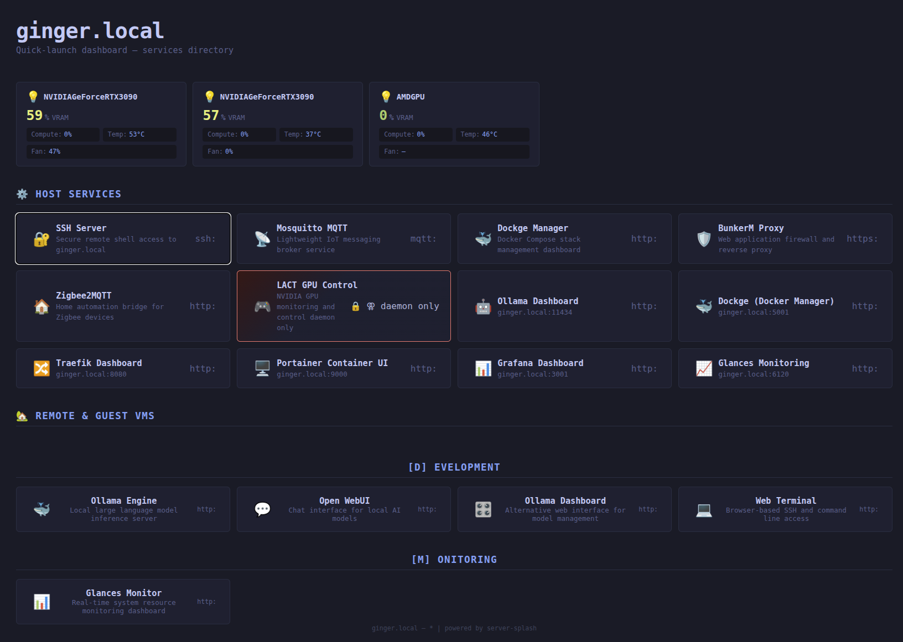

# server-splash

CLI wizard that probes a Linux host, sends results to a local LLM agent for analysis, and generates an HTML dashboard page linking to discovered services. Also generates optional dashboard modules (e.g., Ollama dashboard).

## Requirements

- Rust toolchain (edition 2021)
- A running OpenAI-compatible API endpoint (e.g., Ollama on `http://127.0.0.1:11434`)
- System tools: `systemctl`, `docker`, `nvidia-smi`, `free`, `hostname`

## Build

```
cargo build --release
```

Binary: `target/release/splash`

## Usage

Run the wizard:

```
./target/release/splash
```

### Wizard steps

1. **Hostname** — detected from system, can be overridden
2. **Agent endpoint** — auto-discovers OpenAI-compatible endpoints; user selects model
3. **Host probing** — runs `systemctl`, `docker ps`, `free`, `nvidia-smi`, etc.
4. **Agent analysis** — raw probe output sent to LLM; returns structured service list
5. **Probe table** — editable table where user can:
   - Toggle service inclusion (`s` key, Enter on INC column)
   - Edit endpoint URLs (auto re-probed on change)
   - Edit descriptions
   - Pick icons from a 30-emoji palette
   - Edit service names
   - Navigate with arrow keys / `jk` / tab
6. **GUI addons** — pick from `services.toml` entries (Portainer, Grafana, etc.)
7. **Dashboard modules** — pick from available modules in `src/modules/`
8. **Deployment** — choose output directory or copy to `/var/www/html`

### Caching

Agent responses are cached in `agent-response.json`. On re-run, you are prompted to reuse the cache or re-analyze. Full session state persists in `splash-state.json` — loading a previous session skips directly to the probe table.

### Output

- `splash-server.html` — main dashboard page
- `splash-state.json` — session database (services, endpoints, icons, module selections)
- Per-module output directories (e.g., `ollama-ui/index.html`)

## Adding a dashboard module

Create a directory under `src/modules/` containing:

```
my-module/
  module.json      — { name, description, default_port, icon, url_prefix }
  mod.rs           — module_info() returning DashboardModule with generate fn pointer
  generate.rs      — HTML generation logic
  template.html    — HTML template with <!-- PLACEHOLDER --> markers
  style.css        — stylesheet copied to output
```

Register the module in `src/modules/mod.rs` → `all_modules()`.

## Configuration

Persisted to `~/.config/server-splash/splash-config.toml`:

```toml
agent_url = "http://127.0.0.1:11434"
hostname = "myserver"
output_dir = "./server-splash"
gui_pairs_file = "/path/to/services.toml"
glances_api_base = "http://localhost:61208"
```

GUI addons are defined in `services.toml` (TOML format, one entry per service with `src_port` and `icon`).


